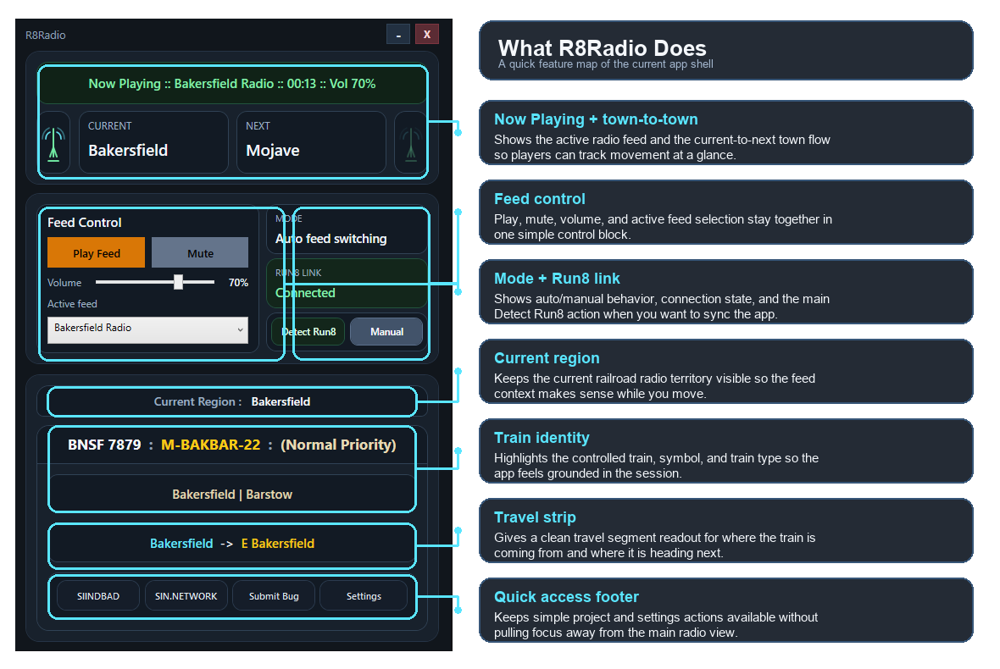

# R8Radio

R8Radio is a desktop companion app for Run8 Train Simulator that helps bring railroad radio chatter to your session in a simple and readable way.

It detects your current Run8 session, reads your in-game location, and follows your movement so the app can stay focused on the right radio territory as you travel. The goal is to give players a cleaner, more immersive radio experience by bringing broadcast-style railroad chatter into the game, without turning the app into something complicated to use.

## What It Does

- Detects your Run8 session from local game data
- Shows current train identity and route context
- Follows town-to-town travel progression
- Tracks region and handoff flow as you move
- Supports live radio feed playback in a compact desktop app
- Includes simple in-app settings for Run8 path detection

  

